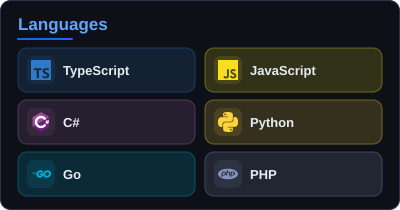
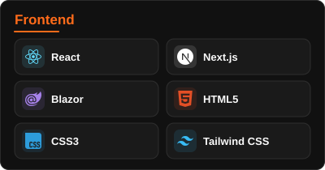
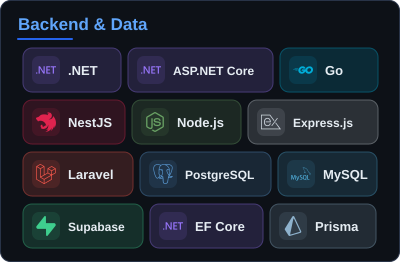
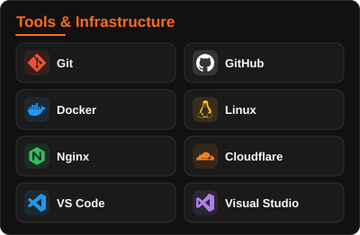

<h1>
  
  Hi, I'm Bora
</h1>

<strong>Full Stack Developer · SaaS Builder · Product Developer</strong>

Building practical software and SaaS products for real-world business needs.

  
  
  
  

 

<h2>
  
  About me
</h2>

I'm a full stack developer and SaaS builder focused on creating practical, scalable software products.

I work across backend development, REST APIs, database architecture, and frontend applications. I'm currently building **Viorasoft**, a SaaS platform focused on business management and digital workflows.

I enjoy turning complex business requirements into reliable, maintainable software, from initial architecture to implementation.

 

<h2>
  
  What I do
</h2>

<table>
  <tr>
    <td width="50%" valign="top">
      
      <strong>Backend & APIs</strong> 
      REST APIs and business logic with ASP.NET Core, NestJS, Node.js, Go and Laravel.
    </td>
    <td width="50%" valign="top">
      
      <strong>Database architecture</strong> 
      Schema design and data access with PostgreSQL, MySQL, Entity Framework Core and Prisma.
    </td>
  </tr>
  <tr>
    <td width="50%" valign="top">
      
      <strong>Frontend applications</strong> 
      Responsive interfaces and dashboards with React, Next.js, Blazor and Tailwind CSS.
    </td>
    <td width="50%" valign="top">
      
      <strong>SaaS products</strong> 
      From initial architecture to deployment with Docker, Linux, Nginx and Cloudflare.
    </td>
  </tr>
</table>

 

<h2>
  
  Education
</h2>

**Computer Programming** · Graduated in 2024

 

<h2>
  
  Tech stack
</h2>

  
  

   

  
  

   

  Also working with Firebase.

 

<h2>
  
  Selected projects
</h2>

<h3>Viorasoft</h3>

A business-focused SaaS platform designed to simplify business workflows, including customer management, offers, orders, payments, and subscription-based features.

C# · ASP.NET Core · Blazor · PostgreSQL · Entity Framework Core · Next.js

 

<h3>Business Management Systems</h3>

Developing practical tools and web applications to help businesses organize operations, manage information, and simplify everyday workflows.

REST APIs · Database Design · Web Development · Automation

 

<h2>
  
  GitHub statistics
</h2>

  
  

 

  
  <strong>Connect</strong>
    
  
  

